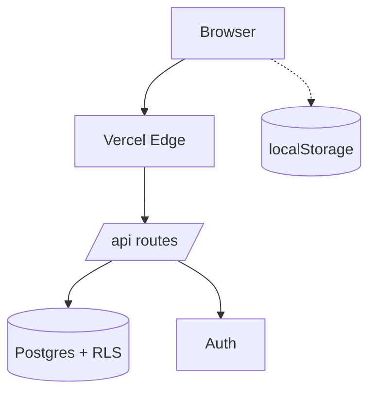
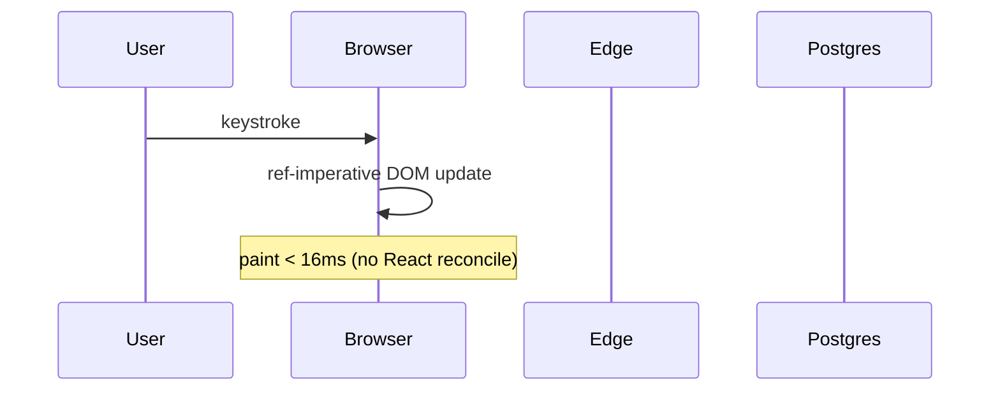

# {Product} — System Architecture

> Companion to DESIGN.md. **What** to build = DESIGN.md. **How it's wired** = this file.
> Visual companion: open `public/architecture/index.html` in a browser. Same source, prettier surface.
> Last updated: {YYYY-MM-DD}

---

## 1. System overview

{One paragraph: what this system *is*, in system terms (not product terms). Top-level shape, primary tech, who calls what. Keep it under 8 lines — the diagram below carries the weight.}



## 2. Components

One row per module/service. **Be specific about file paths** — this is the table future-Claude opens first when extending the system.

| Component | Purpose | Owns | Depends on | Lives in |
|---|---|---|---|---|
| {name} | {what it does, one line} | {state/data it owns} | {what it calls} | `{file path or service name}` |

## 3. Request lifecycles

One sequence diagram per hot-path from DESIGN.md. Tie each to its budget so the diagram and the constraint never drift.

### {lifecycle name} — budget: {ms}ms



## 4. Persistent state topology

Extends DESIGN.md's state map with the **physical** home and failure mode. The DESIGN.md table says where state *logically* lives; this one says what actually breaks if it's gone.

| Name | Logical home (DESIGN) | Physical | TTL | Failure mode |
|---|---|---|---|---|
| {state} | {URL / localStorage / server} | `{table.column}` or `{ls key}` | {duration} | {what happens if missing} |

## 5. Deployment topology

What runs where. Subgraph per environment, edges across trust boundaries.

```mermaid
graph LR
  subgraph Browser
    UI[UI bundle]
    LS[localStorage]
  end
  subgraph "Vercel Edge"
    Routes[/api/*]
  end
  subgraph Supabase
    PG[(Postgres + RLS)]
    AuthSvc[Auth]
  end
  UI --> Routes
  Routes --> PG
  UI --> AuthSvc
```

**Trust boundaries:** {what crosses what, where secrets live, what's RLS-protected, what's signed/verified at the edge}.

## 6. Decision log

The load-bearing architectural calls and the *why*. Future-Claude reads this **first** to avoid relitigating settled debates.

- **{decision}** — {one-line rationale}. Alternatives considered: {what else was on the table}. ({YYYY-MM-DD})

## 7. Out of scope

Intentionally NOT in this system, with the reason. Prevents scope drift on every future feature ask.

- **{not this}** — {why not}.
